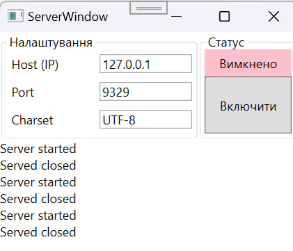
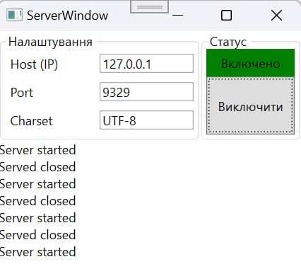
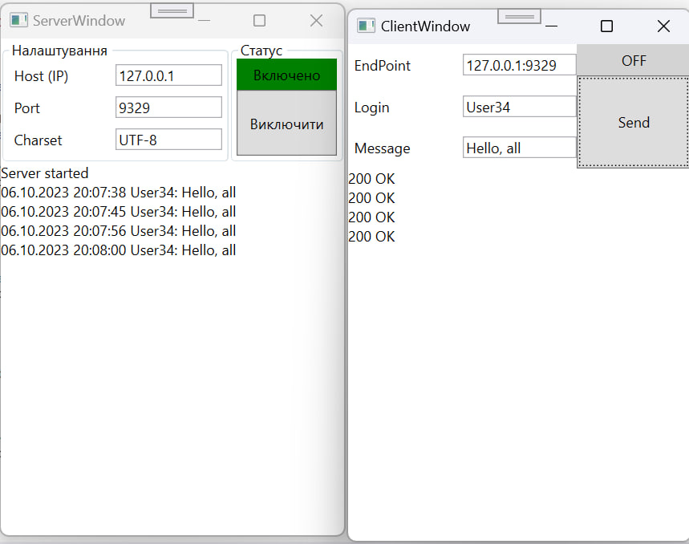
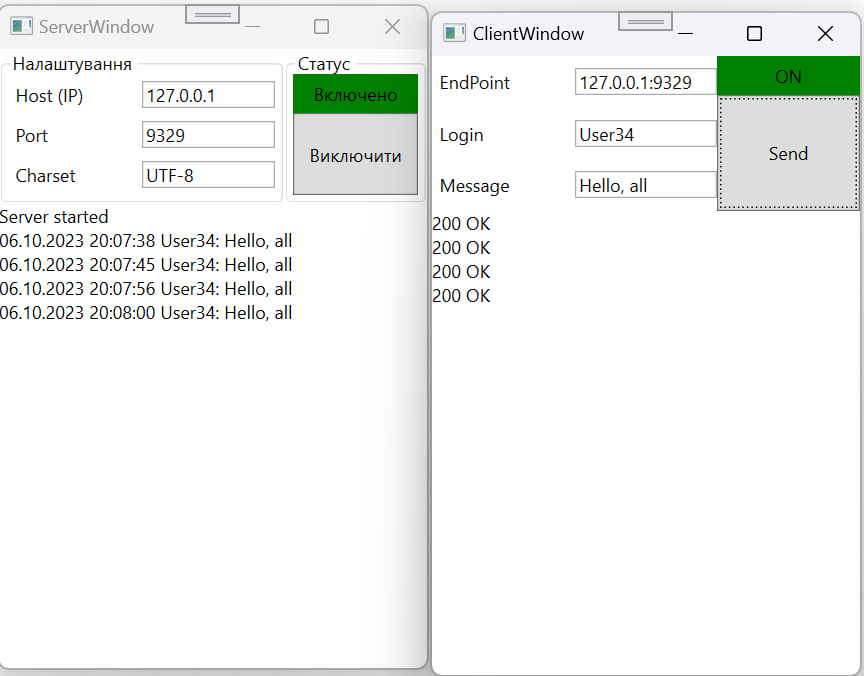
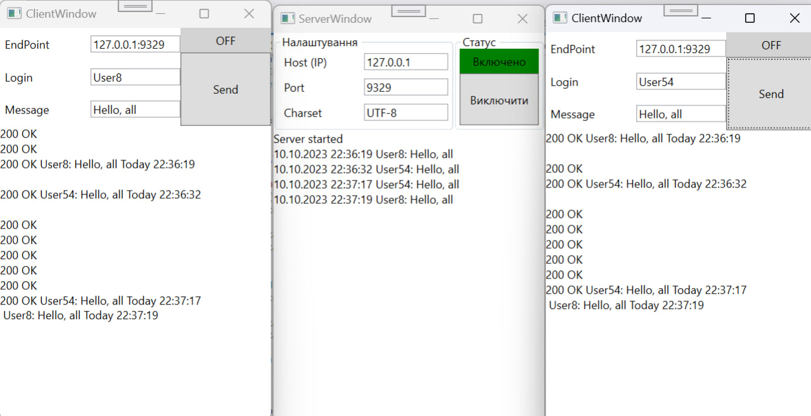
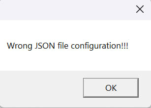
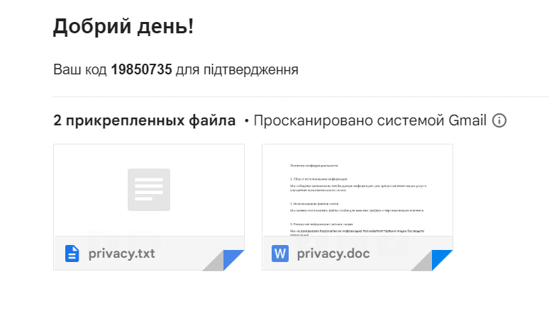
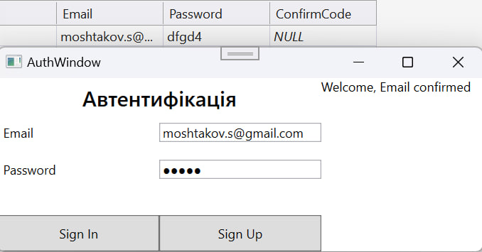
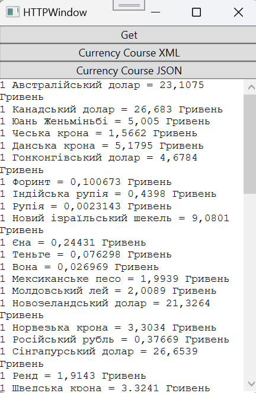
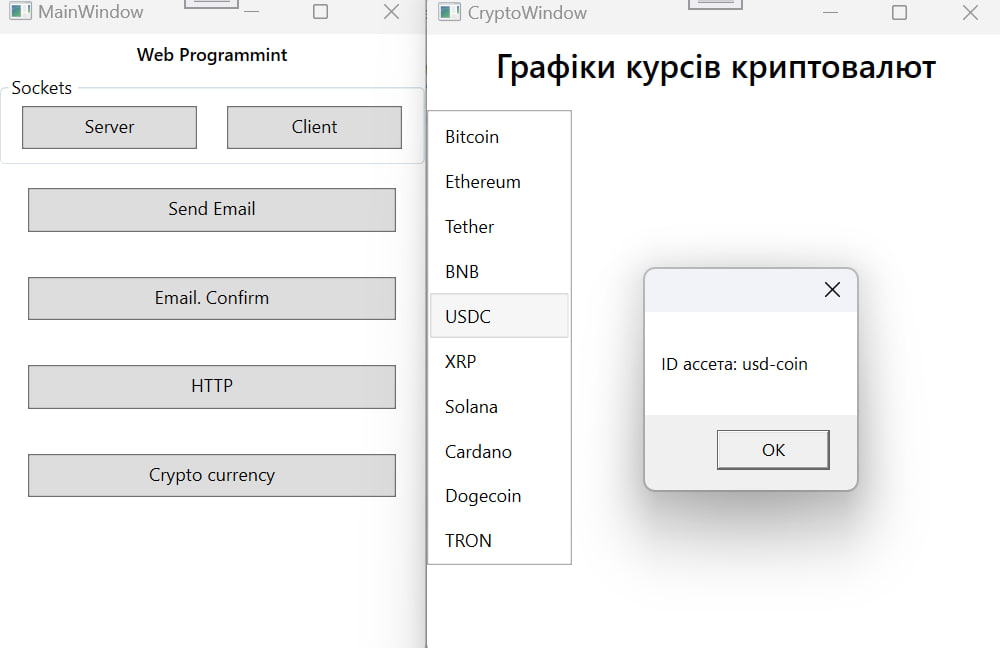

# NerProgramming

## Отображение даты отправки на клиентах

## Отображение ошибки при парсинге JSON

## Сообщение с кодом подтверждения

## Сообщение в случае успешного входа

## Вывод курса валют

## Вывод криптовалют

